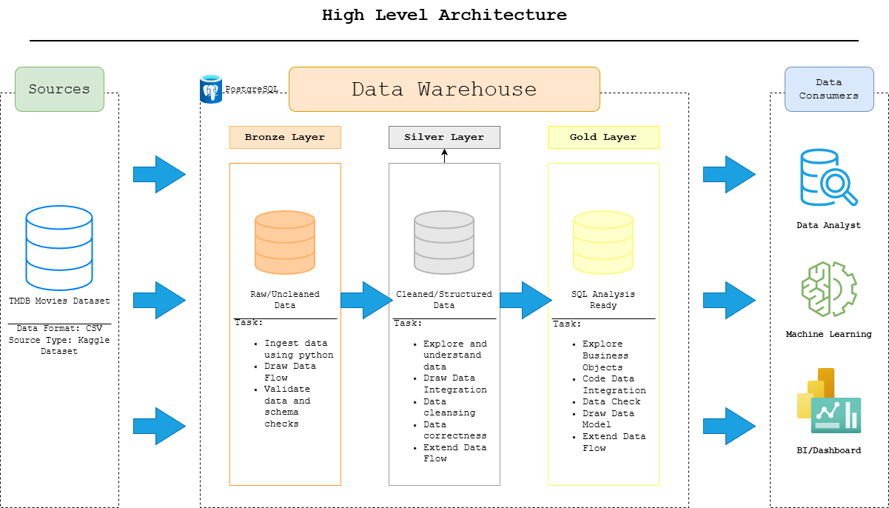

# TMDB Data Warehouse and Analytics Project

Welcome! This project will demonstrate a data warehouse using Python and PostgreSQL.
This project extracts movie data from a Kaggle Dataset using Kaggle API that is sourced from TMDB data and I will then process it through an ETL pipleine to create a structured data warehouse designed for analytics.
The warehouse follows a Medallion Architecture (Bronze, Silver, Gold) and supports SQL-based analysis of movie trends such as genres, ratings, and release patterns.

---
## Tech Stack

| Tool | Purpose |
|---|---|
| Python | ETL scripting — extract and load data |
| Kaggle API | Programmatic dataset download via 'kagglehub' |
| PostgreSQL | Data warehouse storage |
| SQL | Data transformation and analytics |

---
## Data Source

**Dataset:** TMDB Movies Dataset (~1,000,000 movies) sourced from [Kaggle](https://www.kaggle.com/datasets/asaniczka/tmdb-movies-dataset-2023-930k-movies)

The dataset contains movie metadata sourced from The Movie Database (TMDB), including:

- Title, original title, and overview
- Release data and status
- Genres
- Popularity score and vote average
- Runtime, budget, and revenue
- Production companies, countries, and spoken languages
- Keywords

---

## Architecture

This project follows the **Medallion Architecture** pattern, organizing data into three progressive layers (Bronze, Silver, and Gold).

For a full architecture diagram: .

### Bronze Layer
Stores the raw movie data exactly as it appears in the source CSV. No transformations applied. Acts as the original file to fall back on if our code breaks.

### Silver Layer
Cleans and standardizes the raw Bronze data:
- Filters to Released movies only
- Casts all columns to correct data types
- Handles NULL and empty string values
- Removes 1,074 duplicate movie records
- Normalizes genres into a relational bridge table (silver.genres and silver.movie_genres)

Data Cleaning Rules (silver_movies_clean.sql):
- Zero values for budget, revenue, runtime, vote_count, and popularity were set to NULL as they represent unreported data rather than actual zero values
- Release dates before 1888-01-01 set to NULL as cinema did not exist before this date
- Release dates after 2025-12-31 set to NULL to prevent partial period bias in release pattern analysis

### Gold Layer
Produces analytics-ready aggregated tables designed to answer specific business questions about movies popularity, genres, ratings, and release patterns.

---

## Pipeline Execution Order

Run the scripts in the following order. Complete each step fully before moving to the next.

### Step 1 — Database setup
```
scripts/bronze/init_tmdb_database.sql
```
Creates the `tmdb_warehouse` database and the `bronze`, `silver`, and `gold` schemas.
> This drops and recreates the database. Do not run on a live instance with data you want to keep.

### Step 2 — Bronze layer
```
scripts/bronze/extract_tmdb_movies.py     # Downloads the CSV via Kaggle API
scripts/bronze/load_tmdb_movies.py        # Loads the CSV into bronze.tmdb_movies
```

### Step 3 — Silver layer
```
scripts/silver/init_silver_tables.sql     # Creates silver.movies, silver.genres, silver.movie_genres
scripts/silver/silver_movies.sql          # Deduplicates and casts bronze data into silver.movies
scripts/silver/silver_genres.py           # Normalizes genres into silver.genres and silver.movie_genres
scripts/silver/silver_movies_clean.sql    # Applies data cleaning rules (zeros → NULL, invalid dates → NULL)
```

### Step 4 — Gold layer
```
scripts/gold/init_gold_tables.sql         # Creates gold.movie_metrics, gold.genre_metrics, gold.release_metrics
scripts/gold/gold_movie_metrics.sql       # Loads movie performance metrics
scripts/gold/gold_genre_metrics.sql       # Loads movie-genre pairs with popularity
scripts/gold/gold_release_metrics.sql     # Loads release timing metrics
```

### Step 5 — Quality checks (optional but recommended)
```
tests/silver_quality_checks.sql           # Validates silver layer integrity
tests/gold_quality_checks.sql             # Validates gold layer integrity
```

---

---

## Analytics & Reporting

### Objective
Provide an analytics-ready dataset that allows exploration of trends in movie popularity.

The warehouse supports analysis such as:

- Which movies have the highest popularity scores?
- Most common genres among popular movies?
- Average runtime of popular movies?
- Release timing patterns
- Relationship between ratings and popularity

## Repository Structure

```
tmdb-warehouse/
├── datasets/
│   └── raw/                          # Raw CSV file (not committed to git)
├── docs/
│   ├── TMDB_data_architecture.drawio # High-level architecture diagram
│   ├── TMDB_data_flow.drawio         # Table-level data flow diagram
│   └── data_catalog.md               # Gold layer data dictionary
├── scripts/
│   ├── bronze/
│   │   ├── init_tmdb_database.sql    # Database and schema setup
│   │   ├── extract_tmdb_movies.py    # Download dataset via Kaggle API
│   │   └── load_tmdb_movies.py       # Load CSV into bronze layer
│   ├── silver/
│   │   ├── init_silver_tables.sql    # Create silver layer tables
│   │   ├── silver_movies.sql         # Deduplicate and cast movies
│   │   ├── silver_genres.py          # Normalize genres into bridge table
│   │   └── silver_movies_clean.sql   # Apply data cleaning rules
│   └── gold/
│       ├── init_gold_tables.sql      # Create gold layer tables
│       ├── gold_movie_metrics.sql    # Movie performance metrics
│       ├── gold_genre_metrics.sql    # Genre popularity metrics
│       └── gold_release_metrics.sql  # Release timing metrics
├── tests/
│   ├── silver_quality_checks.sql     # Silver layer validation queries
│   └── gold_quality_checks.sql       # Gold layer validation queries
├── .env.example                      # Environment variable template
├── .gitignore
├── requirements.txt
└── README.md
```

---

## Getting Started

### Prerequisites
- Python 3.8+
- PostgreSQL
- A Kaggle account with an API key ('kaggle.json')

### Setup

1. Clone the repository and create a virtual environment:
```bash
python -m venv venv
source venv/bin/activate      # Mac/Linux
venv\Scripts\activate         # Windows
pip install -r requirements.txt
```

2. Copy `.env.example` to `.env` and fill in your credentials:
```bash
cp .env.example .env
```

3. Follow the **Pipeline Execution Order** section above.

---

## License

This project is licensed under the MIT License. You are free to use, modify, and distribute this project for educational or personal use.\

## About Me

Hello! I'm **Adriel Velasquez**, and I am currently a Computer Science Major at Stony Brook University with a goal of becoming a Data Engineer. 
I love to explore how data can be transformed into useful insights. Through projects like this one, I am to develop practical data engineering skills and create systems that help people explore and understand data.
